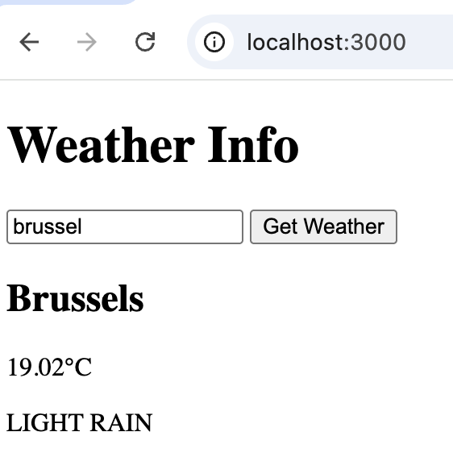

# WheaterApp demo with the MVVM architecture

## This is a Wheater app demo that uses async/await
### There are several ways to make it asynchronous

Callbacks → messy, hard to read (callback hell)

Promises → better, but still chained .then().catch()

async/await → cleaner, more readable, like synchronous code

## API key
Get a free API key from https://openweathermap.org/
and paste it in the .env file.

## Start the app
use npm run dev to start the app, the app will render the inde.html file in public folder and make an API call to the router when you search for the weather in you're City.
